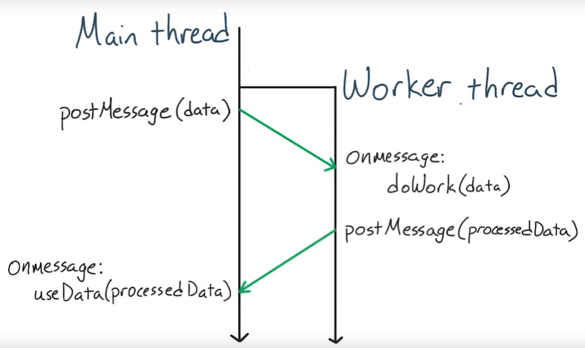
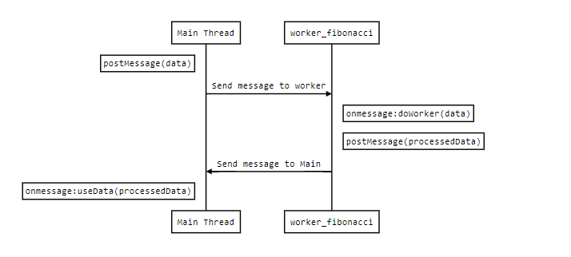
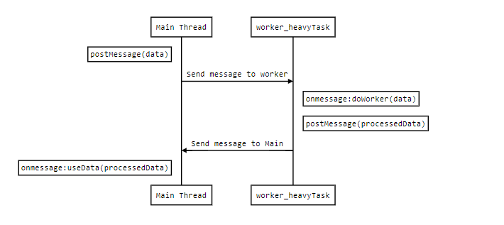

# Web Worker



JavaScript 通常在作業系統的 Main Thread 執行，但若把程式碼放在 Web Workers 就可另闢戰場-Worker Thread，兩條線互不影響，讓 JavaScript 在背景執行，並且兩線可由訊息溝通-使用 postMessage 發送訊息、onmessage 接收訊息。

通常我們會將需要長時間運算且不含 Window 或 DOM Element 操作的程式碼放在 Web Workers，好處是不阻塞 Main Thread 而讓速度變快。

## 本範例的 Event model for web workers

### worker_fibonacci


### worker_heavyTask


## worker1 - Web Workers API

使用 web API 來實作

[MDN-Web Workers API](https://developer.mozilla.org/en-US/docs/Web/API/Web_Workers_API)

## worker2 - VueUse - useWebWorker

用起來跟用 web API 很像，只是多封裝成方法

[VueUse - useWebWorker](https://vueuse.org/core/useWebWorker/)

## worker3 - VueUse - useWebWorkerFn

封裝成更好用的方法，也是三種裡最簡化的寫法，也有狀態可以使用，
worker terminate 之後也不會有 worker1、worker2 的問題 (無法再次使用)
官方的例子看起來跟 comlink 差不多

[VueUse - useWebWorkerFn](https://vueuse.org/core/useWebWorkerFn/)

## 補充 
這邊使用 postMessage、onmessage 來傳遞資料
也許之後可以用 [comlink](https://github.com/GoogleChromeLabs/comlink) 寫寫看，看[鐵人賽](https://ithelp.ithome.com.tw/articles/10337926) 感覺可以更方便，只是看起來只能搭配 Web Workers API

## Recommended IDE Setup

[VSCode](https://code.visualstudio.com/) + [Volar](https://marketplace.visualstudio.com/items?itemName=Vue.volar) (and disable Vetur) + [TypeScript Vue Plugin (Volar)](https://marketplace.visualstudio.com/items?itemName=Vue.vscode-typescript-vue-plugin).

## Customize configuration

See [Vite Configuration Reference](https://vitejs.dev/config/).

## Project Setup

```sh
npm install
```

### Compile and Hot-Reload for Development

```sh
npm run dev
```

### Compile and Minify for Production

```sh
npm run build
```

### Lint with [ESLint](https://eslint.org/)

```sh
npm run lint
```

---
## 參考資料 reference
[Web Workers](https://www.cythilya.tw/2018/07/18/web-workers/)

[封裝 Web worker 的套件 - Comlink](https://ithelp.ithome.com.tw/articles/10337926)